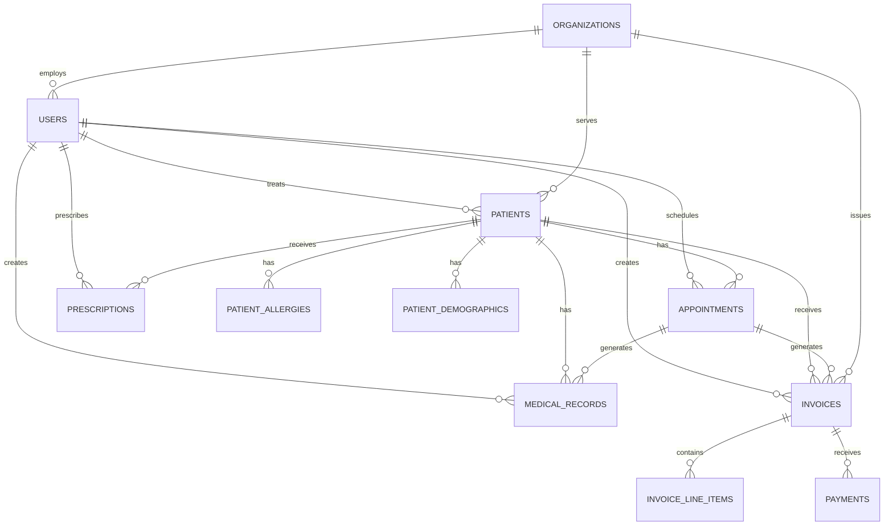

# VirtualDoc - Database Schema Design

## 🗄️ Database Architecture Overview

VirtualDoc uses a microservices architecture with each service having its own database schema. This document outlines the complete database design for all services.

## 📊 Database Design Principles

### 1. Microservices Database Pattern
- **Database per Service**: Each microservice has its own database
- **Data Consistency**: Eventual consistency through events
- **Service Independence**: Services can evolve independently
- **Data Isolation**: Complete data isolation between services

### 2. Database Technology Stack
- **Primary Database**: PostgreSQL 15+
- **Cache Database**: Redis 7+
- **Search Database**: Elasticsearch 8+
- **File Storage**: MinIO/S3

## 🏗️ Core Database Schemas

### Authentication Service Database

```sql
-- Users table
CREATE TABLE users (
    id UUID PRIMARY KEY DEFAULT gen_random_uuid(),
    email VARCHAR(255) UNIQUE NOT NULL,
    password_hash VARCHAR(255) NOT NULL,
    first_name VARCHAR(100) NOT NULL,
    last_name VARCHAR(100) NOT NULL,
    role VARCHAR(50) NOT NULL CHECK (role IN ('admin', 'doctor', 'nurse', 'receptionist', 'patient')),
    organization_id UUID REFERENCES organizations(id),
    is_email_verified BOOLEAN DEFAULT FALSE,
    is_active BOOLEAN DEFAULT TRUE,
    last_login_at TIMESTAMP,
    created_at TIMESTAMP DEFAULT CURRENT_TIMESTAMP,
    updated_at TIMESTAMP DEFAULT CURRENT_TIMESTAMP
);

-- Organizations table
CREATE TABLE organizations (
    id UUID PRIMARY KEY DEFAULT gen_random_uuid(),
    name VARCHAR(255) NOT NULL,
    type VARCHAR(50) NOT NULL CHECK (type IN ('individual', 'clinic', 'hospital', 'network')),
    address TEXT,
    phone VARCHAR(20),
    email VARCHAR(255),
    website VARCHAR(255),
    license_number VARCHAR(100),
    is_active BOOLEAN DEFAULT TRUE,
    created_at TIMESTAMP DEFAULT CURRENT_TIMESTAMP,
    updated_at TIMESTAMP DEFAULT CURRENT_TIMESTAMP
);

-- User sessions table
CREATE TABLE user_sessions (
    id UUID PRIMARY KEY DEFAULT gen_random_uuid(),
    user_id UUID REFERENCES users(id) ON DELETE CASCADE,
    token_hash VARCHAR(255) NOT NULL,
    refresh_token_hash VARCHAR(255) NOT NULL,
    expires_at TIMESTAMP NOT NULL,
    created_at TIMESTAMP DEFAULT CURRENT_TIMESTAMP
);

-- Password reset tokens
CREATE TABLE password_reset_tokens (
    id UUID PRIMARY KEY DEFAULT gen_random_uuid(),
    user_id UUID REFERENCES users(id) ON DELETE CASCADE,
    token_hash VARCHAR(255) NOT NULL,
    expires_at TIMESTAMP NOT NULL,
    used_at TIMESTAMP,
    created_at TIMESTAMP DEFAULT CURRENT_TIMESTAMP
);
```

### Patient Service Database

```sql
-- Patients table
CREATE TABLE patients (
    id UUID PRIMARY KEY DEFAULT gen_random_uuid(),
    patient_id VARCHAR(50) UNIQUE NOT NULL, -- Human-readable ID
    first_name VARCHAR(100) NOT NULL,
    last_name VARCHAR(100) NOT NULL,
    date_of_birth DATE NOT NULL,
    gender VARCHAR(20) CHECK (gender IN ('male', 'female', 'other', 'prefer_not_to_say')),
    phone VARCHAR(20),
    email VARCHAR(255),
    address TEXT,
    emergency_contact_name VARCHAR(100),
    emergency_contact_phone VARCHAR(20),
    emergency_contact_relationship VARCHAR(50),
    medical_record_number VARCHAR(50),
    insurance_provider VARCHAR(100),
    insurance_number VARCHAR(50),
    primary_physician_id UUID REFERENCES users(id),
    organization_id UUID REFERENCES organizations(id),
    is_active BOOLEAN DEFAULT TRUE,
    created_at TIMESTAMP DEFAULT CURRENT_TIMESTAMP,
    updated_at TIMESTAMP DEFAULT CURRENT_TIMESTAMP
);

-- Patient demographics
CREATE TABLE patient_demographics (
    id UUID PRIMARY KEY DEFAULT gen_random_uuid(),
    patient_id UUID REFERENCES patients(id) ON DELETE CASCADE,
    height_cm DECIMAL(5,2),
    weight_kg DECIMAL(5,2),
    blood_type VARCHAR(10),
    ethnicity VARCHAR(50),
    marital_status VARCHAR(20),
    occupation VARCHAR(100),
    education_level VARCHAR(50),
    created_at TIMESTAMP DEFAULT CURRENT_TIMESTAMP,
    updated_at TIMESTAMP DEFAULT CURRENT_TIMESTAMP
);

-- Patient allergies
CREATE TABLE patient_allergies (
    id UUID PRIMARY KEY DEFAULT gen_random_uuid(),
    patient_id UUID REFERENCES patients(id) ON DELETE CASCADE,
    allergen VARCHAR(100) NOT NULL,
    reaction_type VARCHAR(100),
    severity VARCHAR(20) CHECK (severity IN ('mild', 'moderate', 'severe')),
    notes TEXT,
    created_at TIMESTAMP DEFAULT CURRENT_TIMESTAMP
);

-- Patient medical history
CREATE TABLE patient_medical_history (
    id UUID PRIMARY KEY DEFAULT gen_random_uuid(),
    patient_id UUID REFERENCES patients(id) ON DELETE CASCADE,
    condition_name VARCHAR(200) NOT NULL,
    diagnosis_date DATE,
    status VARCHAR(20) CHECK (status IN ('active', 'resolved', 'chronic')),
    notes TEXT,
    created_by UUID REFERENCES users(id),
    created_at TIMESTAMP DEFAULT CURRENT_TIMESTAMP
);
```

### Appointment Service Database

```sql
-- Appointments table
CREATE TABLE appointments (
    id UUID PRIMARY KEY DEFAULT gen_random_uuid(),
    appointment_id VARCHAR(50) UNIQUE NOT NULL,
    patient_id UUID REFERENCES patients(id) ON DELETE CASCADE,
    provider_id UUID REFERENCES users(id),
    appointment_type VARCHAR(50) NOT NULL,
    status VARCHAR(20) NOT NULL CHECK (status IN ('scheduled', 'confirmed', 'in_progress', 'completed', 'cancelled', 'no_show')),
    scheduled_date DATE NOT NULL,
    scheduled_time TIME NOT NULL,
    duration_minutes INTEGER DEFAULT 30,
    location VARCHAR(100),
    notes TEXT,
    reason_for_visit TEXT,
    created_at TIMESTAMP DEFAULT CURRENT_TIMESTAMP,
    updated_at TIMESTAMP DEFAULT CURRENT_TIMESTAMP
);

-- Appointment reminders
CREATE TABLE appointment_reminders (
    id UUID PRIMARY KEY DEFAULT gen_random_uuid(),
    appointment_id UUID REFERENCES appointments(id) ON DELETE CASCADE,
    reminder_type VARCHAR(20) CHECK (reminder_type IN ('email', 'sms', 'push')),
    scheduled_at TIMESTAMP NOT NULL,
    sent_at TIMESTAMP,
    status VARCHAR(20) CHECK (status IN ('pending', 'sent', 'failed')),
    created_at TIMESTAMP DEFAULT CURRENT_TIMESTAMP
);

-- Provider availability
CREATE TABLE provider_availability (
    id UUID PRIMARY KEY DEFAULT gen_random_uuid(),
    provider_id UUID REFERENCES users(id) ON DELETE CASCADE,
    day_of_week INTEGER CHECK (day_of_week BETWEEN 0 AND 6), -- 0 = Sunday
    start_time TIME NOT NULL,
    end_time TIME NOT NULL,
    is_available BOOLEAN DEFAULT TRUE,
    created_at TIMESTAMP DEFAULT CURRENT_TIMESTAMP
);
```

### Medical Records Service Database

```sql
-- Medical records
CREATE TABLE medical_records (
    id UUID PRIMARY KEY DEFAULT gen_random_uuid(),
    record_id VARCHAR(50) UNIQUE NOT NULL,
    patient_id UUID REFERENCES patients(id) ON DELETE CASCADE,
    provider_id UUID REFERENCES users(id),
    appointment_id UUID REFERENCES appointments(id),
    record_type VARCHAR(50) NOT NULL,
    title VARCHAR(200) NOT NULL,
    content TEXT NOT NULL,
    diagnosis_codes JSONB, -- ICD-10 codes
    procedure_codes JSONB, -- CPT codes
    vital_signs JSONB,
    attachments JSONB, -- File references
    is_confidential BOOLEAN DEFAULT FALSE,
    created_at TIMESTAMP DEFAULT CURRENT_TIMESTAMP,
    updated_at TIMESTAMP DEFAULT CURRENT_TIMESTAMP
);

-- Prescriptions
CREATE TABLE prescriptions (
    id UUID PRIMARY KEY DEFAULT gen_random_uuid(),
    prescription_id VARCHAR(50) UNIQUE NOT NULL,
    patient_id UUID REFERENCES patients(id) ON DELETE CASCADE,
    provider_id UUID REFERENCES users(id),
    medication_name VARCHAR(200) NOT NULL,
    dosage VARCHAR(100) NOT NULL,
    frequency VARCHAR(100) NOT NULL,
    duration VARCHAR(100) NOT NULL,
    instructions TEXT,
    quantity INTEGER,
    refills INTEGER DEFAULT 0,
    status VARCHAR(20) CHECK (status IN ('active', 'completed', 'cancelled')),
    prescribed_date DATE NOT NULL,
    created_at TIMESTAMP DEFAULT CURRENT_TIMESTAMP
);

-- Lab results
CREATE TABLE lab_results (
    id UUID PRIMARY KEY DEFAULT gen_random_uuid(),
    result_id VARCHAR(50) UNIQUE NOT NULL,
    patient_id UUID REFERENCES patients(id) ON DELETE CASCADE,
    provider_id UUID REFERENCES users(id),
    test_name VARCHAR(200) NOT NULL,
    test_type VARCHAR(100) NOT NULL,
    results JSONB NOT NULL,
    reference_range JSONB,
    status VARCHAR(20) CHECK (status IN ('pending', 'completed', 'abnormal')),
    lab_name VARCHAR(200),
    ordered_date DATE,
    result_date DATE,
    created_at TIMESTAMP DEFAULT CURRENT_TIMESTAMP
);
```

### Billing Service Database

```sql
-- Invoices
CREATE TABLE invoices (
    id UUID PRIMARY KEY DEFAULT gen_random_uuid(),
    invoice_number VARCHAR(50) UNIQUE NOT NULL,
    patient_id UUID REFERENCES patients(id),
    organization_id UUID REFERENCES organizations(id),
    provider_id UUID REFERENCES users(id),
    appointment_id UUID REFERENCES appointments(id),
    status VARCHAR(20) CHECK (status IN ('draft', 'sent', 'paid', 'overdue', 'cancelled')),
    subtotal DECIMAL(10,2) NOT NULL,
    tax_amount DECIMAL(10,2) DEFAULT 0,
    discount_amount DECIMAL(10,2) DEFAULT 0,
    total_amount DECIMAL(10,2) NOT NULL,
    due_date DATE,
    paid_date DATE,
    payment_method VARCHAR(50),
    notes TEXT,
    created_at TIMESTAMP DEFAULT CURRENT_TIMESTAMP,
    updated_at TIMESTAMP DEFAULT CURRENT_TIMESTAMP
);

-- Invoice line items
CREATE TABLE invoice_line_items (
    id UUID PRIMARY KEY DEFAULT gen_random_uuid(),
    invoice_id UUID REFERENCES invoices(id) ON DELETE CASCADE,
    description VARCHAR(200) NOT NULL,
    quantity INTEGER NOT NULL,
    unit_price DECIMAL(10,2) NOT NULL,
    total_price DECIMAL(10,2) NOT NULL,
    created_at TIMESTAMP DEFAULT CURRENT_TIMESTAMP
);

-- Payments
CREATE TABLE payments (
    id UUID PRIMARY KEY DEFAULT gen_random_uuid(),
    payment_id VARCHAR(50) UNIQUE NOT NULL,
    invoice_id UUID REFERENCES invoices(id),
    amount DECIMAL(10,2) NOT NULL,
    payment_method VARCHAR(50) NOT NULL,
    payment_status VARCHAR(20) CHECK (payment_status IN ('pending', 'completed', 'failed', 'refunded')),
    transaction_id VARCHAR(100),
    processed_at TIMESTAMP,
    created_at TIMESTAMP DEFAULT CURRENT_TIMESTAMP
);
```

### Notification Service Database

```sql
-- Notifications
CREATE TABLE notifications (
    id UUID PRIMARY KEY DEFAULT gen_random_uuid(),
    user_id UUID REFERENCES users(id) ON DELETE CASCADE,
    type VARCHAR(50) NOT NULL,
    title VARCHAR(200) NOT NULL,
    message TEXT NOT NULL,
    channel VARCHAR(20) CHECK (channel IN ('email', 'sms', 'push', 'in_app')),
    status VARCHAR(20) CHECK (status IN ('pending', 'sent', 'delivered', 'failed')),
    sent_at TIMESTAMP,
    read_at TIMESTAMP,
    created_at TIMESTAMP DEFAULT CURRENT_TIMESTAMP
);

-- Notification templates
CREATE TABLE notification_templates (
    id UUID PRIMARY KEY DEFAULT gen_random_uuid(),
    name VARCHAR(100) UNIQUE NOT NULL,
    type VARCHAR(50) NOT NULL,
    channel VARCHAR(20) NOT NULL,
    subject VARCHAR(200),
    body_template TEXT NOT NULL,
    variables JSONB, -- Template variables
    is_active BOOLEAN DEFAULT TRUE,
    created_at TIMESTAMP DEFAULT CURRENT_TIMESTAMP,
    updated_at TIMESTAMP DEFAULT CURRENT_TIMESTAMP
);
```

### File Service Database

```sql
-- Files
CREATE TABLE files (
    id UUID PRIMARY KEY DEFAULT gen_random_uuid(),
    file_id VARCHAR(50) UNIQUE NOT NULL,
    original_name VARCHAR(255) NOT NULL,
    file_name VARCHAR(255) NOT NULL,
    file_path VARCHAR(500) NOT NULL,
    file_size BIGINT NOT NULL,
    mime_type VARCHAR(100) NOT NULL,
    file_type VARCHAR(50) NOT NULL,
    uploaded_by UUID REFERENCES users(id),
    patient_id UUID REFERENCES patients(id),
    is_public BOOLEAN DEFAULT FALSE,
    access_level VARCHAR(20) CHECK (access_level IN ('public', 'private', 'confidential')),
    created_at TIMESTAMP DEFAULT CURRENT_TIMESTAMP
);

-- File access logs
CREATE TABLE file_access_logs (
    id UUID PRIMARY KEY DEFAULT gen_random_uuid(),
    file_id UUID REFERENCES files(id) ON DELETE CASCADE,
    user_id UUID REFERENCES users(id),
    action VARCHAR(20) CHECK (action IN ('view', 'download', 'upload', 'delete')),
    ip_address INET,
    user_agent TEXT,
    created_at TIMESTAMP DEFAULT CURRENT_TIMESTAMP
);
```

### Audit Service Database

```sql
-- Audit logs
CREATE TABLE audit_logs (
    id UUID PRIMARY KEY DEFAULT gen_random_uuid(),
    user_id UUID REFERENCES users(id),
    action VARCHAR(100) NOT NULL,
    resource_type VARCHAR(50) NOT NULL,
    resource_id UUID,
    old_values JSONB,
    new_values JSONB,
    ip_address INET,
    user_agent TEXT,
    created_at TIMESTAMP DEFAULT CURRENT_TIMESTAMP
);

-- System events
CREATE TABLE system_events (
    id UUID PRIMARY KEY DEFAULT gen_random_uuid(),
    event_type VARCHAR(100) NOT NULL,
    event_data JSONB NOT NULL,
    severity VARCHAR(20) CHECK (severity IN ('info', 'warning', 'error', 'critical')),
    source VARCHAR(100) NOT NULL,
    created_at TIMESTAMP DEFAULT CURRENT_TIMESTAMP
);
```

## 🔗 Database Relationships

### Entity Relationship Diagram



## 📊 Database Indexes

### Performance Optimization Indexes

```sql
-- User indexes
CREATE INDEX idx_users_email ON users(email);
CREATE INDEX idx_users_organization_id ON users(organization_id);
CREATE INDEX idx_users_role ON users(role);
CREATE INDEX idx_users_created_at ON users(created_at);

-- Patient indexes
CREATE INDEX idx_patients_patient_id ON patients(patient_id);
CREATE INDEX idx_patients_organization_id ON patients(organization_id);
CREATE INDEX idx_patients_primary_physician_id ON patients(primary_physician_id);
CREATE INDEX idx_patients_created_at ON patients(created_at);

-- Appointment indexes
CREATE INDEX idx_appointments_patient_id ON appointments(patient_id);
CREATE INDEX idx_appointments_provider_id ON appointments(provider_id);
CREATE INDEX idx_appointments_scheduled_date ON appointments(scheduled_date);
CREATE INDEX idx_appointments_status ON appointments(status);

-- Medical records indexes
CREATE INDEX idx_medical_records_patient_id ON medical_records(patient_id);
CREATE INDEX idx_medical_records_provider_id ON medical_records(provider_id);
CREATE INDEX idx_medical_records_record_type ON medical_records(record_type);
CREATE INDEX idx_medical_records_created_at ON medical_records(created_at);

-- Invoice indexes
CREATE INDEX idx_invoices_patient_id ON invoices(patient_id);
CREATE INDEX idx_invoices_organization_id ON invoices(organization_id);
CREATE INDEX idx_invoices_status ON invoices(status);
CREATE INDEX idx_invoices_due_date ON invoices(due_date);

-- Audit log indexes
CREATE INDEX idx_audit_logs_user_id ON audit_logs(user_id);
CREATE INDEX idx_audit_logs_resource_type ON audit_logs(resource_type);
CREATE INDEX idx_audit_logs_created_at ON audit_logs(created_at);
```

## 🔒 Database Security

### Row Level Security (RLS)

```sql
-- Enable RLS on sensitive tables
ALTER TABLE patients ENABLE ROW LEVEL SECURITY;
ALTER TABLE medical_records ENABLE ROW LEVEL SECURITY;
ALTER TABLE prescriptions ENABLE ROW LEVEL SECURITY;
ALTER TABLE invoices ENABLE ROW LEVEL SECURITY;

-- Patient data access policy
CREATE POLICY patient_access_policy ON patients
    FOR ALL TO authenticated_users
    USING (
        organization_id = current_setting('app.current_organization_id')::uuid
        OR primary_physician_id = current_setting('app.current_user_id')::uuid
    );

-- Medical records access policy
CREATE POLICY medical_records_access_policy ON medical_records
    FOR ALL TO authenticated_users
    USING (
        provider_id = current_setting('app.current_user_id')::uuid
        OR patient_id IN (
            SELECT id FROM patients 
            WHERE primary_physician_id = current_setting('app.current_user_id')::uuid
        )
    );
```

## 📈 Database Monitoring

### Performance Monitoring Queries

```sql
-- Slow query monitoring
SELECT 
    query,
    calls,
    total_time,
    mean_time,
    rows
FROM pg_stat_statements 
ORDER BY total_time DESC 
LIMIT 10;

-- Table size monitoring
SELECT 
    schemaname,
    tablename,
    pg_size_pretty(pg_total_relation_size(schemaname||'.'||tablename)) as size
FROM pg_tables 
WHERE schemaname = 'public'
ORDER BY pg_total_relation_size(schemaname||'.'||tablename) DESC;

-- Index usage monitoring
SELECT 
    schemaname,
    tablename,
    indexname,
    idx_scan,
    idx_tup_read,
    idx_tup_fetch
FROM pg_stat_user_indexes 
ORDER BY idx_scan DESC;
```

## 🚀 Database Migration Strategy

### Migration Scripts

```sql
-- Version 1.0.0 - Initial schema
-- Version 1.1.0 - Add patient demographics
-- Version 1.2.0 - Add appointment reminders
-- Version 1.3.0 - Add file management
-- Version 2.0.0 - Add multi-tenant support
```

This comprehensive database schema provides a solid foundation for the VirtualDoc platform, ensuring data integrity, performance, and security across all microservices.
