# VirtualDoc - System Architecture Diagrams

## 🏗️ High-Level System Architecture

### Overall System Overview

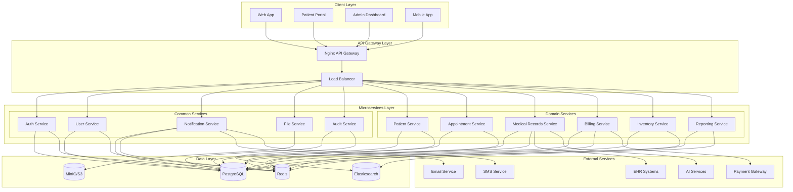

## 🔐 Security Architecture

### Security Layers

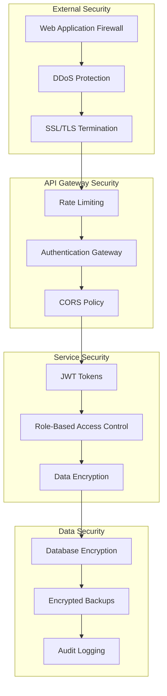

## 📊 Data Flow Architecture

### Patient Data Flow

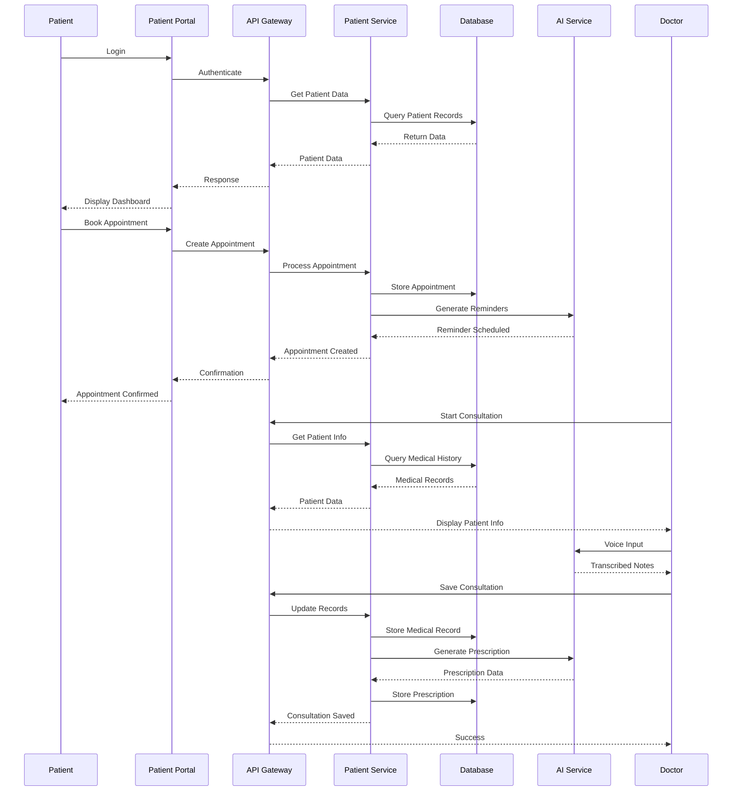

## 🌐 Deployment Architecture

### Production Deployment

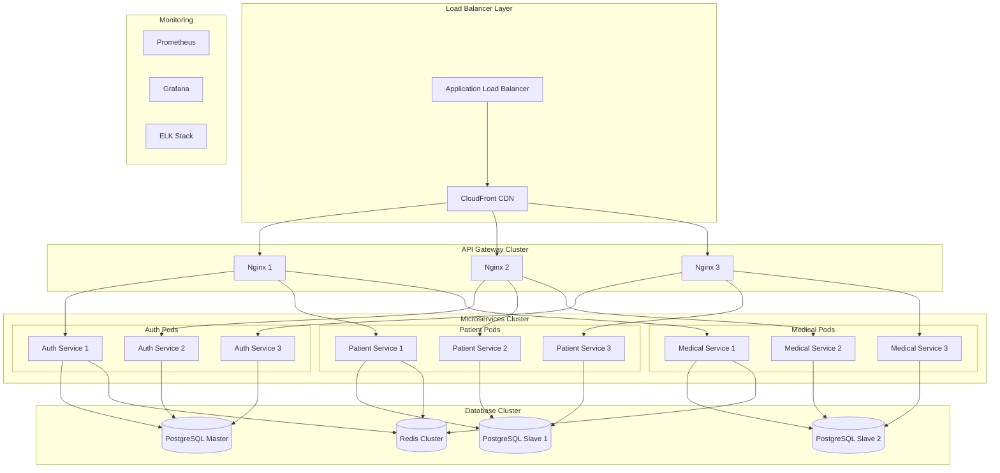

## 🔄 Microservices Communication

### Service-to-Service Communication

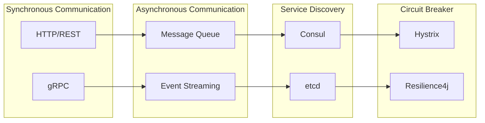

## 📱 Mobile Architecture

### Mobile App Architecture

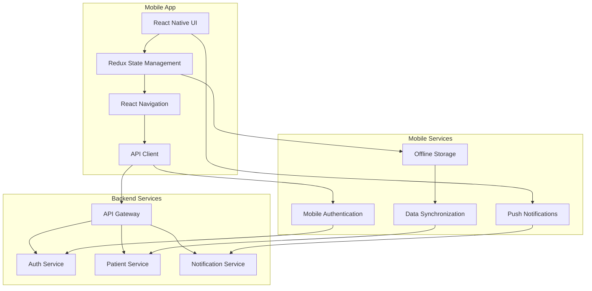

## 🤖 AI Integration Architecture

### AI Services Integration

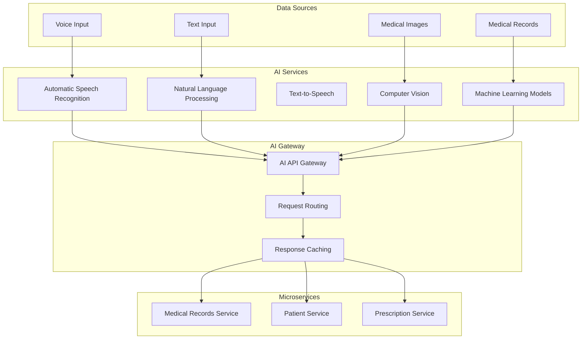

## 📊 Monitoring and Observability

### Monitoring Stack

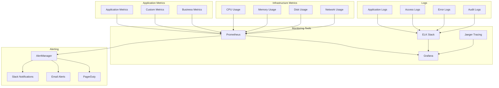

## 🔄 CI/CD Pipeline Architecture

### Continuous Integration/Deployment

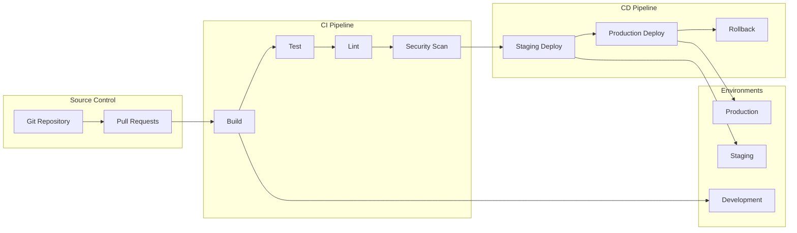

## 🌍 Global Deployment Architecture

### Multi-Region Deployment

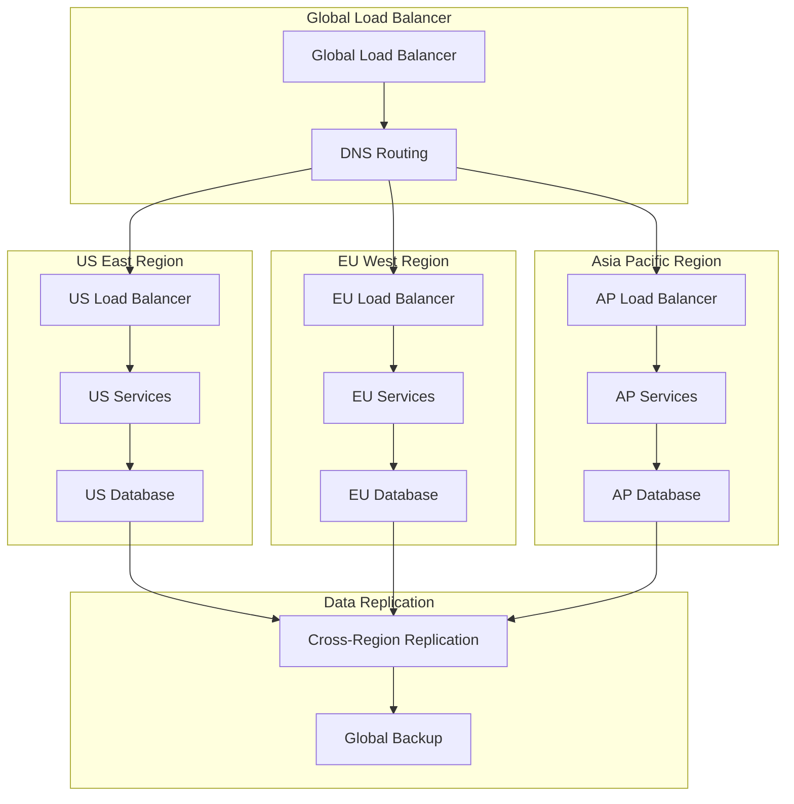

## 📈 Scalability Architecture

### Auto-Scaling Configuration

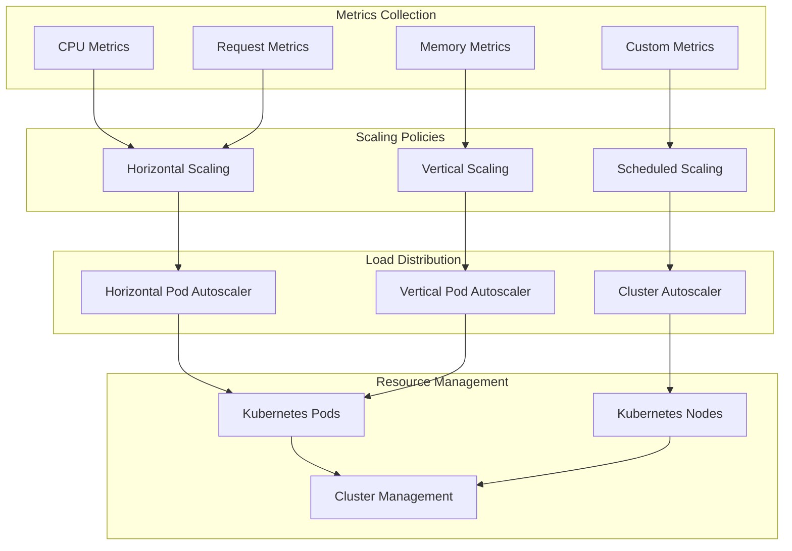

This comprehensive system architecture documentation provides a complete technical overview of the VirtualDoc platform, ensuring scalability, security, and maintainability across all components.
