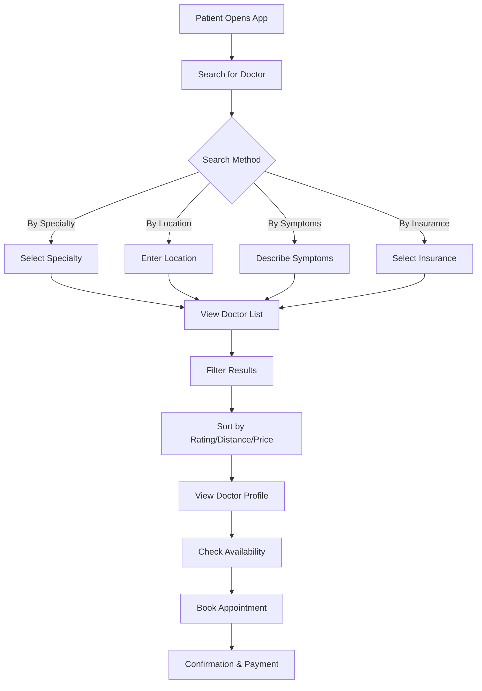
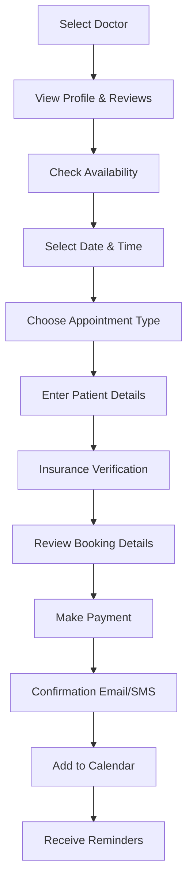
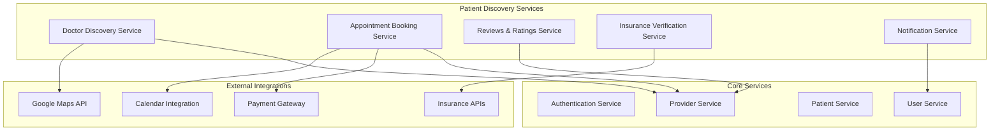

# VirtualDoc - Patient Discovery & Booking Platform

## 🎯 Platform Overview

The Patient Discovery Platform is a comprehensive healthcare marketplace that allows patients to discover, compare, and book appointments with healthcare providers across multiple specialties, locations, and service types.

## 🌟 Key Features

### 🔍 Doctor Discovery
- **Search by Specialty**: Find doctors by medical specialty
- **Location-Based Search**: Find doctors near patient location
- **Availability Search**: Real-time appointment availability
- **Rating & Reviews**: Patient reviews and ratings
- **Insurance Acceptance**: Filter by accepted insurance plans

### 📅 Appointment Booking
- **Real-Time Scheduling**: Live appointment booking
- **Multiple Appointment Types**: In-person, telemedicine, home visits
- **Instant Confirmation**: Immediate booking confirmation
- **Reminder System**: Automated appointment reminders
- **Rescheduling**: Easy appointment modification

### 🏥 Provider Profiles
- **Comprehensive Profiles**: Doctor credentials, experience, specialties
- **Practice Information**: Clinic details, location, hours
- **Services Offered**: Available treatments and procedures
- **Pricing Information**: Consultation fees and payment options
- **Patient Reviews**: Authentic patient feedback and ratings

## 🎯 User Personas

### 1. Primary Patient (Sarah, 28)
- **Profile**: Young professional, new to city
- **Needs**: Find a family doctor, urgent care options
- **Pain Points**: Don't know local doctors, insurance confusion
- **Goals**: Quick access to quality healthcare

### 2. Chronic Care Patient (Robert, 65)
- **Profile**: Senior with multiple conditions
- **Needs**: Specialist care, medication management
- **Pain Points**: Complex care coordination, multiple appointments
- **Goals**: Comprehensive care management

### 3. Parent (Maria, 35)
- **Profile**: Mother of two children
- **Needs**: Pediatric care, family medicine
- **Pain Points**: Child-specific care, emergency situations
- **Goals**: Reliable family healthcare

## 🔄 User Flow Diagrams

### Doctor Discovery Flow



### Appointment Booking Flow



## 📱 Mobile App Features

### Home Screen
```
┌─────────────────────────────────────────────────────────────────┐
│ VirtualDoc - Find Your Doctor                    [Profile][🔔]  │
├─────────────────────────────────────────────────────────────────┤
│ ┌─────────────────────────────────────────────────────────────┐ │
│ │ 🔍 Search doctors, specialties, or symptoms                │ │
│ └─────────────────────────────────────────────────────────────┘ │
├─────────────────────────────────────────────────────────────────┤
│ Quick Access                                                    │
│ ┌─────────────┐ ┌─────────────┐ ┌─────────────┐ ┌─────────────┐ │
│ │ 🏥 Urgent   │ │ 👨‍⚕️ Find    │ │ 💊 Pharmacy │ │ 📋 My       │ │
│ │ Care        │ │ Doctor      │ │ Services    │ │ Records     │ │
│ └─────────────┘ └─────────────┘ └─────────────┘ └─────────────┘ │
├─────────────────────────────────────────────────────────────────┤
│ Nearby Doctors                                                  │
│ ┌─────────────────────────────────────────────────────────────┐ │
│ │ 👩‍⚕️ Dr. Sarah Johnson - Family Medicine                   │ │
│ │ ⭐ 4.8 (127 reviews) • 0.5 miles • $150                   │ │
│ │ Available: Today 2:00 PM, Tomorrow 10:00 AM                │ │
│ │ [View Profile] [Book Now]                                   │ │
│ └─────────────────────────────────────────────────────────────┘ │
├─────────────────────────────────────────────────────────────────┤
│ Popular Specialties                                            │
│ ┌─────────────┐ ┌─────────────┐ ┌─────────────┐ ┌─────────────┐ │
│ │ 🫀 Cardiology│ │ 🧠 Neurology│ │ 👶 Pediatrics│ │ 🦴 Orthopedics│ │
│ └─────────────┘ └─────────────┘ └─────────────┘ └─────────────┘ │
└─────────────────────────────────────────────────────────────────┘
```

### Doctor Search Results
```
┌─────────────────────────────────────────────────────────────────┐
│ Family Medicine Doctors in Downtown                    [Filter]  │
├─────────────────────────────────────────────────────────────────┤
│ ┌─────────────────────────────────────────────────────────────┐ │
│ │ 👩‍⚕️ Dr. Sarah Johnson                                      │ │
│ │ Family Medicine • 8 years experience                       │ │
│ │ ⭐ 4.8 (127 reviews) • 0.5 miles • $150                   │ │
│ │ Available: Today 2:00 PM, Tomorrow 10:00 AM               │ │
│ │ Accepts: Blue Cross, Aetna, Medicare                       │ │
│ │ [View Profile] [Book Now]                                  │ │
│ └─────────────────────────────────────────────────────────────┘ │
│ ┌─────────────────────────────────────────────────────────────┐ │
│ │ 👨‍⚕️ Dr. Michael Chen                                      │ │
│ │ Family Medicine • 12 years experience                      │ │
│ │ ⭐ 4.6 (89 reviews) • 1.2 miles • $175                    │ │
│ │ Available: Tomorrow 9:00 AM, Wed 3:00 PM                  │ │
│ │ Accepts: Blue Cross, Cigna, Medicaid                       │ │
│ │ [View Profile] [Book Now]                                  │ │
│ └─────────────────────────────────────────────────────────────┘ │
└─────────────────────────────────────────────────────────────────┘
```

### Doctor Profile Page
```
┌─────────────────────────────────────────────────────────────────┐
│ Dr. Sarah Johnson                                    [Book Now] │
├─────────────────────────────────────────────────────────────────┤
│ ┌─────────────┐ Family Medicine Specialist                     │ │
│ │     [👩‍⚕️]    │ ⭐ 4.8 (127 reviews) • 8 years experience    │ │
│ │             │ Downtown Medical Center                        │ │
│ └─────────────┘ 123 Main St, Downtown                          │ │
├─────────────────────────────────────────────────────────────────┤
│ About Dr. Johnson                                              │
│ Dr. Sarah Johnson is a board-certified family medicine          │
│ physician with 8 years of experience. She specializes in        │
│ preventive care, chronic disease management, and women's      │
│ health.                                                         │
├─────────────────────────────────────────────────────────────────┤
│ Education & Credentials                                        │
│ • MD, Harvard Medical School (2015)                            │
│ • Residency: Johns Hopkins Hospital                            │
│ • Board Certified: American Board of Family Medicine          │
├─────────────────────────────────────────────────────────────────┤
│ Services & Pricing                                             │
│ • Consultation: $150                                           │
│ • Follow-up: $100                                              │
│ • Annual Physical: $200                                        │
│ • Telemedicine: $120                                          │
├─────────────────────────────────────────────────────────────────┤
│ Availability                                                    │
│ ┌─────┬─────┬─────┬─────┬─────┬─────┬─────┐                   │
│ │ Mon │ Tue │ Wed │ Thu │ Fri │ Sat │ Sun │                   │
│ │ 9-5 │ 9-5 │ 9-5 │ 9-5 │ 9-5 │ 9-1 │ Off │                   │
│ └─────┴─────┴─────┴─────┴─────┴─────┴─────┘                   │
├─────────────────────────────────────────────────────────────────┤
│ Patient Reviews                                                │
│ ┌─────────────────────────────────────────────────────────────┐ │
│ │ ⭐⭐⭐⭐⭐ "Dr. Johnson is amazing! Very thorough and caring." │ │
│ │ - Sarah M. (2 days ago)                                    │ │
│ │ ⭐⭐⭐⭐⭐ "Great bedside manner and excellent diagnosis."      │ │
│ │ - John D. (1 week ago)                                     │ │
│ └─────────────────────────────────────────────────────────────┘ │
└─────────────────────────────────────────────────────────────────┘
```

## 🏗️ Technical Architecture

### Microservices for Patient Discovery



### Database Schema for Discovery Platform

```sql
-- Doctor Discovery Service Database
CREATE TABLE doctor_profiles (
    id UUID PRIMARY KEY DEFAULT gen_random_uuid(),
    doctor_id UUID REFERENCES users(id),
    specialty VARCHAR(100) NOT NULL,
    sub_specialties TEXT[],
    years_experience INTEGER,
    education TEXT[],
    certifications TEXT[],
    languages_spoken TEXT[],
    consultation_fee DECIMAL(10,2),
    follow_up_fee DECIMAL(10,2),
    telemedicine_fee DECIMAL(10,2),
    home_visit_fee DECIMAL(10,2),
    is_accepting_new_patients BOOLEAN DEFAULT TRUE,
    profile_image_url VARCHAR(500),
    bio TEXT,
    created_at TIMESTAMP DEFAULT CURRENT_TIMESTAMP,
    updated_at TIMESTAMP DEFAULT CURRENT_TIMESTAMP
);

-- Practice Information
CREATE TABLE practice_locations (
    id UUID PRIMARY KEY DEFAULT gen_random_uuid(),
    doctor_id UUID REFERENCES users(id),
    practice_name VARCHAR(200) NOT NULL,
    address TEXT NOT NULL,
    city VARCHAR(100) NOT NULL,
    state VARCHAR(100) NOT NULL,
    zip_code VARCHAR(20) NOT NULL,
    country VARCHAR(100) NOT NULL,
    latitude DECIMAL(10,8),
    longitude DECIMAL(11,8),
    phone VARCHAR(20),
    email VARCHAR(255),
    website VARCHAR(255),
    is_primary_location BOOLEAN DEFAULT FALSE,
    created_at TIMESTAMP DEFAULT CURRENT_TIMESTAMP
);

-- Services Offered
CREATE TABLE doctor_services (
    id UUID PRIMARY KEY DEFAULT gen_random_uuid(),
    doctor_id UUID REFERENCES users(id),
    service_name VARCHAR(200) NOT NULL,
    service_description TEXT,
    service_type VARCHAR(50) NOT NULL, -- consultation, procedure, test
    duration_minutes INTEGER,
    price DECIMAL(10,2),
    is_available BOOLEAN DEFAULT TRUE,
    created_at TIMESTAMP DEFAULT CURRENT_TIMESTAMP
);

-- Insurance Acceptance
CREATE TABLE insurance_accepted (
    id UUID PRIMARY KEY DEFAULT gen_random_uuid(),
    doctor_id UUID REFERENCES users(id),
    insurance_provider VARCHAR(100) NOT NULL,
    plan_name VARCHAR(200),
    is_primary BOOLEAN DEFAULT FALSE,
    created_at TIMESTAMP DEFAULT CURRENT_TIMESTAMP
);

-- Patient Reviews
CREATE TABLE doctor_reviews (
    id UUID PRIMARY KEY DEFAULT gen_random_uuid(),
    doctor_id UUID REFERENCES users(id),
    patient_id UUID REFERENCES users(id),
    appointment_id UUID REFERENCES appointments(id),
    rating INTEGER CHECK (rating BETWEEN 1 AND 5),
    review_title VARCHAR(200),
    review_text TEXT,
    is_verified BOOLEAN DEFAULT FALSE,
    is_public BOOLEAN DEFAULT TRUE,
    created_at TIMESTAMP DEFAULT CURRENT_TIMESTAMP,
    updated_at TIMESTAMP DEFAULT CURRENT_TIMESTAMP
);

-- Search Index
CREATE TABLE doctor_search_index (
    id UUID PRIMARY KEY DEFAULT gen_random_uuid(),
    doctor_id UUID REFERENCES users(id),
    search_vector tsvector,
    specialty_vector tsvector,
    location_vector tsvector,
    updated_at TIMESTAMP DEFAULT CURRENT_TIMESTAMP
);

-- Create indexes for performance
CREATE INDEX idx_doctor_profiles_specialty ON doctor_profiles(specialty);
CREATE INDEX idx_doctor_profiles_location ON practice_locations(city, state);
CREATE INDEX idx_doctor_reviews_rating ON doctor_reviews(rating);
CREATE INDEX idx_doctor_search_vector ON doctor_search_index USING GIN(search_vector);
```

## 🎯 User Stories for Discovery Platform

### Epic 1: Doctor Discovery

#### US-DP-001: Search Doctors by Specialty
**As a** patient  
**I want to** search for doctors by medical specialty  
**So that** I can find the right type of healthcare provider  

**Acceptance Criteria:**
- [ ] Patient can search by specialty (cardiology, dermatology, etc.)
- [ ] Search results show relevant doctors
- [ ] Results include doctor ratings and availability
- [ ] Search can be filtered by location, price, insurance
- [ ] Search results are paginated and sortable

**Priority:** High  
**Story Points:** 8

#### US-DP-002: Location-Based Doctor Search
**As a** patient  
**I want to** find doctors near my location  
**So that** I can access convenient healthcare  

**Acceptance Criteria:**
- [ ] Patient can search by current location or address
- [ ] Results show distance from patient location
- [ ] Map view shows doctor locations
- [ ] Search radius can be adjusted
- [ ] Results sorted by distance by default

**Priority:** High  
**Story Points:** 8

#### US-DP-003: Doctor Profile Viewing
**As a** patient  
**I want to** view detailed doctor profiles  
**So that** I can make informed decisions about my healthcare  

**Acceptance Criteria:**
- [ ] Profile shows doctor credentials and experience
- [ ] Services and pricing are clearly displayed
- [ ] Patient reviews and ratings are visible
- [ ] Availability calendar is shown
- [ ] Contact information is available

**Priority:** High  
**Story Points:** 8

### Epic 2: Appointment Booking

#### US-DP-004: Real-Time Appointment Booking
**As a** patient  
**I want to** book appointments in real-time  
**So that** I can secure my preferred time slot  

**Acceptance Criteria:**
- [ ] Available time slots are shown in real-time
- [ ] Patient can select date and time
- [ ] Appointment type can be selected (in-person, telemedicine)
- [ ] Booking confirmation is immediate
- [ ] Confirmation email/SMS is sent

**Priority:** High  
**Story Points:** 13

#### US-DP-005: Insurance Verification
**As a** patient  
**I want to** verify my insurance coverage  
**So that** I know what costs I'll be responsible for  

**Acceptance Criteria:**
- [ ] Patient can enter insurance information
- [ ] Coverage is verified in real-time
- [ ] Copay and deductible information is shown
- [ ] Out-of-pocket costs are calculated
- [ ] Insurance verification is stored for future use

**Priority:** Medium  
**Story Points:** 13

### Epic 3: Reviews and Ratings

#### US-DP-006: Patient Reviews
**As a** patient  
**I want to** read reviews from other patients  
**So that** I can choose the best doctor for my needs  

**Acceptance Criteria:**
- [ ] Reviews are displayed on doctor profiles
- [ ] Reviews include rating, title, and detailed text
- [ ] Reviews are verified (from actual appointments)
- [ ] Reviews can be filtered and sorted
- [ ] Review authenticity is maintained

**Priority:** High  
**Story Points:** 8

#### US-DP-007: Leave Doctor Review
**As a** patient  
**I want to** leave reviews for doctors  
**So that** I can help other patients make informed decisions  

**Acceptance Criteria:**
- [ ] Patient can leave review after appointment
- [ ] Review includes rating (1-5 stars) and text
- [ ] Review is verified against appointment record
- [ ] Review can be edited within 30 days
- [ ] Review is published after moderation

**Priority:** Medium  
**Story Points:** 8

## 📊 Business Model Integration

### Revenue Streams for Discovery Platform

#### 1. Commission-Based Model
- **Doctor Listing Fee**: $50-200/month per doctor
- **Booking Commission**: 5-10% of appointment value
- **Premium Listings**: $100-500/month for featured placement
- **Sponsored Results**: $0.50-2.00 per click

#### 2. Subscription Model
- **Patient Premium**: $9.99/month for premium features
- **Doctor Premium**: $99-299/month for advanced features
- **Enterprise**: Custom pricing for healthcare systems

#### 3. Transaction Fees
- **Payment Processing**: 2.9% + $0.30 per transaction
- **Insurance Verification**: $0.50-1.00 per verification
- **SMS/Email Notifications**: $0.01-0.05 per message

### Integration with Existing Tiers

#### Freemium Tier Integration
- **Basic Doctor Listings**: Free for doctors
- **Basic Search**: Free for patients
- **Limited Reviews**: 5 reviews per doctor
- **Standard Support**: Email support only

#### Premium Tier Integration
- **Enhanced Listings**: Rich profiles and media
- **Advanced Search**: Multiple filters and sorting
- **Unlimited Reviews**: No review limits
- **Priority Support**: Phone and chat support

#### Enterprise Tier Integration
- **White-Label Solution**: Custom branding
- **API Access**: Full platform integration
- **Custom Features**: Tailored functionality
- **Dedicated Support**: Account manager

## 🌍 Global Expansion Strategy

### Market-Specific Features

#### India Market
- **ABHA ID Integration**: Seamless health record access
- **Hindi/Regional Languages**: Local language support
- **Ayurvedic Doctors**: Traditional medicine practitioners
- **Government Schemes**: Integration with government health programs

#### US Market
- **HIPAA Compliance**: Full regulatory compliance
- **Epic/Cerner Integration**: EHR system integration
- **Insurance Networks**: Major insurance provider integration
- **Telemedicine**: State-specific telemedicine regulations

#### European Market
- **GDPR Compliance**: Data protection compliance
- **Multi-Language**: EU language support
- **Cross-Border Care**: International patient services
- **EU Health Card**: European health insurance integration

## 🚀 Implementation Roadmap

### Phase 1: Foundation (Months 1-3)
- **Core Discovery Service**: Basic doctor search and profiles
- **Appointment Booking**: Real-time booking system
- **Mobile App**: iOS and Android applications
- **Basic Reviews**: Simple rating and review system

### Phase 2: Enhancement (Months 4-6)
- **Advanced Search**: Multiple filters and AI-powered recommendations
- **Insurance Integration**: Real-time insurance verification
- **Telemedicine**: Video consultation booking
- **Analytics Dashboard**: Provider analytics and insights

### Phase 3: Scale (Months 7-12)
- **AI Recommendations**: Personalized doctor recommendations
- **Marketplace Features**: Advanced marketplace functionality
- **International Expansion**: Multi-country support
- **Enterprise Features**: White-label and API solutions

## 📈 Success Metrics

### User Engagement
- **Monthly Active Users**: Target 100K+ MAU
- **Search Conversion**: 15%+ search-to-booking rate
- **User Retention**: 60%+ monthly retention
- **App Store Rating**: 4.5+ stars

### Business Metrics
- **Revenue per User**: $50+ annual revenue per patient
- **Doctor Adoption**: 10,000+ doctors in first year
- **Booking Volume**: 100,000+ appointments per month
- **Market Share**: 5%+ of digital health booking market

This comprehensive patient discovery platform perfectly complements VirtualDoc's existing ecosystem, creating a complete healthcare marketplace that benefits both patients and providers while generating additional revenue streams.
