# VirtualDoc - User Flow Diagrams

## 🎯 User Flow Overview

This document outlines the complete user flows for all user types in the VirtualDoc platform, from registration to daily operations.

## 👥 User Types and Personas

### 1. Individual Doctor (Dr. Sarah)
- **Profile**: Solo practitioner, 2,000 patients
- **Goals**: Digitize practice, improve efficiency
- **Pain Points**: Time-consuming paperwork, manual processes

### 2. Clinic Manager (Dr. Raj)
- **Profile**: Multi-doctor clinic, 5,000 patients
- **Goals**: Manage team, optimize operations
- **Pain Points**: Coordination, reporting, compliance

### 3. Hospital Administrator (Dr. James)
- **Profile**: Large hospital system, 50,000+ patients
- **Goals**: System integration, compliance, analytics
- **Pain Points**: Complex workflows, data silos

### 4. Patient (John Doe)
- **Profile**: Regular patient, uses portal
- **Goals**: Easy access to care, manage appointments
- **Pain Points**: Communication, appointment scheduling

## 🔄 Core User Flows

### 1. Doctor Onboarding Flow

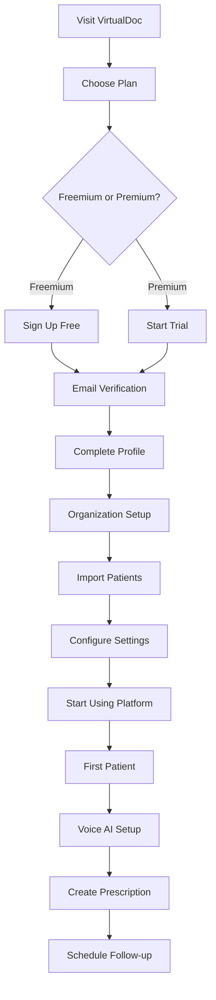

### 2. Patient Registration Flow

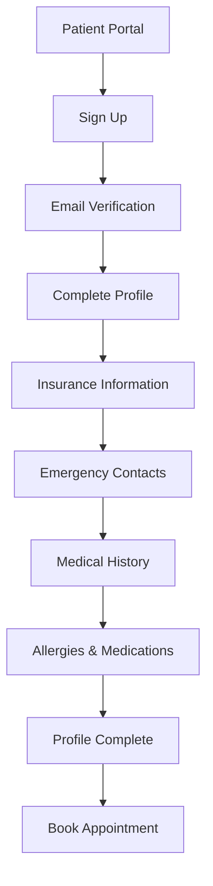

### 3. Appointment Scheduling Flow

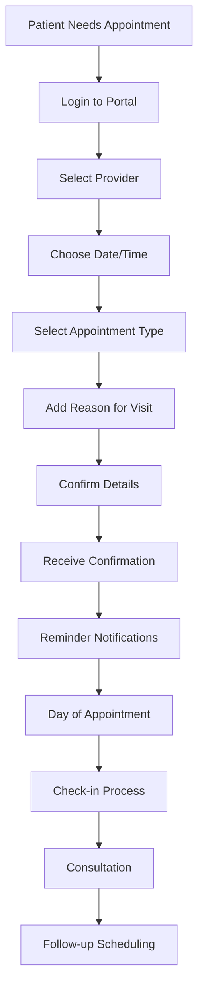

### 4. Consultation Flow (AI-Powered)

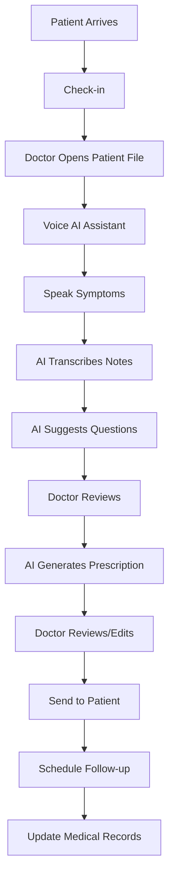

### 5. Prescription Management Flow

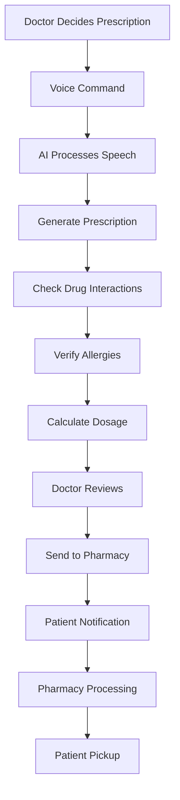

## 🏥 Specialty-Specific Flows

### 1. Cardiology Flow

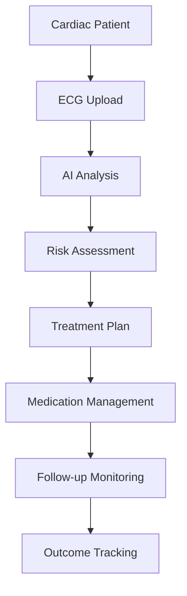

### 2. Mental Health Flow

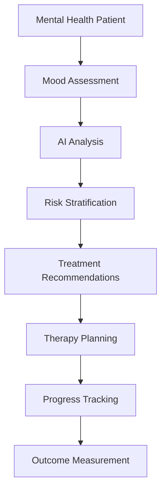

### 3. Pediatrics Flow

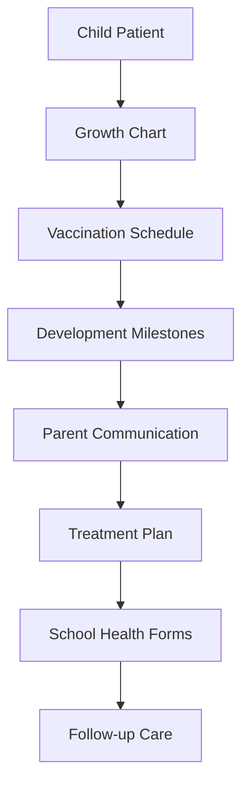

## 📱 Mobile App Flows

### 1. Doctor Mobile App

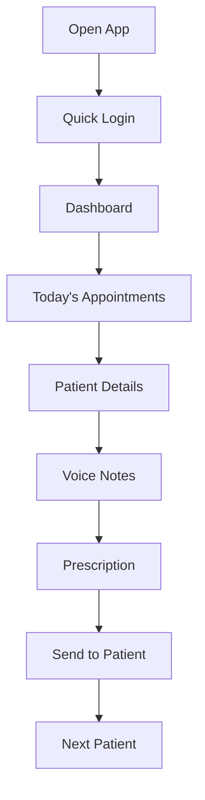

### 2. Patient Mobile App

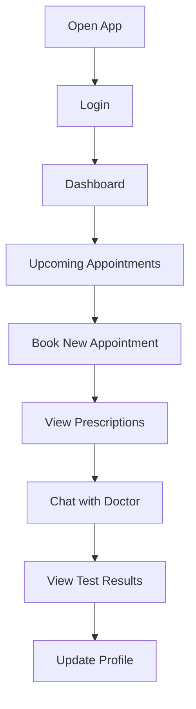

## 🔄 Administrative Flows

### 1. Clinic Management Flow

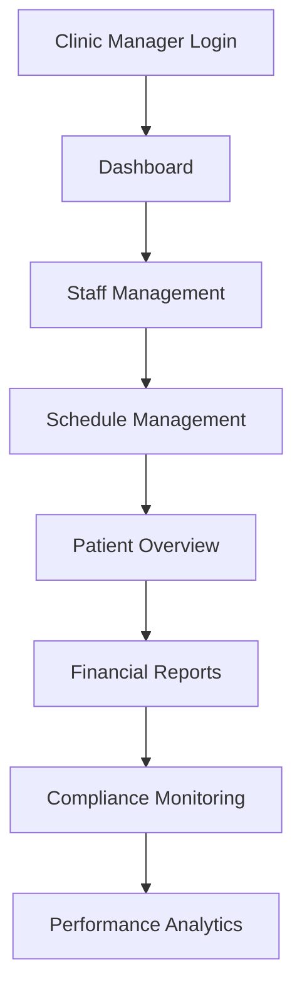

### 2. Hospital Administration Flow

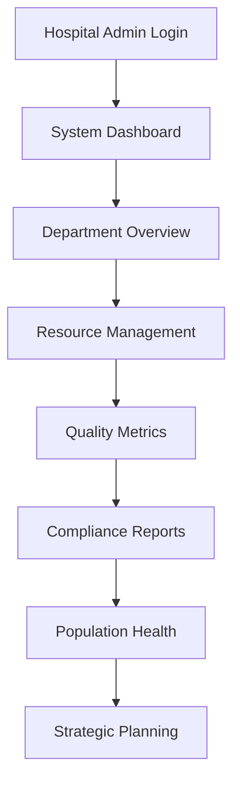

## 🌍 Global User Flows

### 1. Multi-Language Support Flow

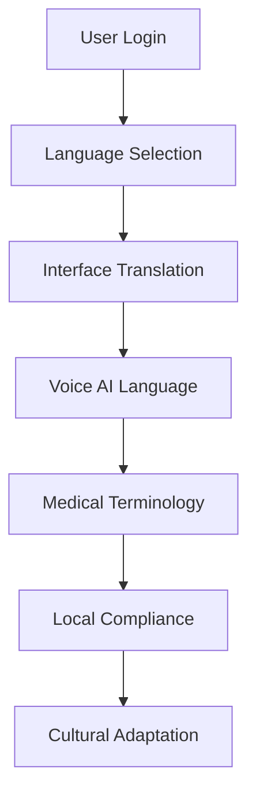

### 2. Government Integration Flow (ABHA ID)

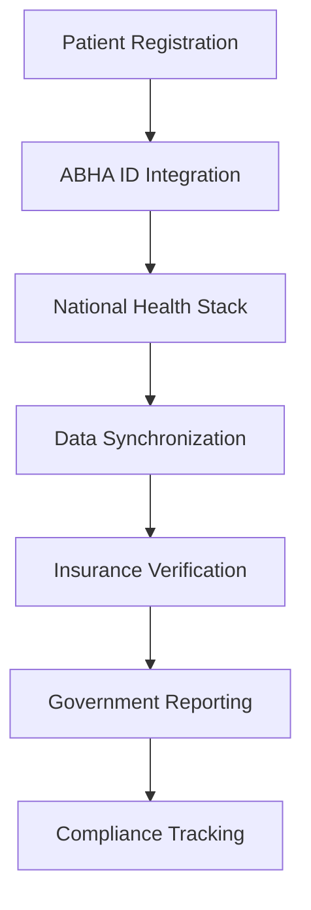

## 📊 Analytics and Reporting Flows

### 1. Practice Analytics Flow

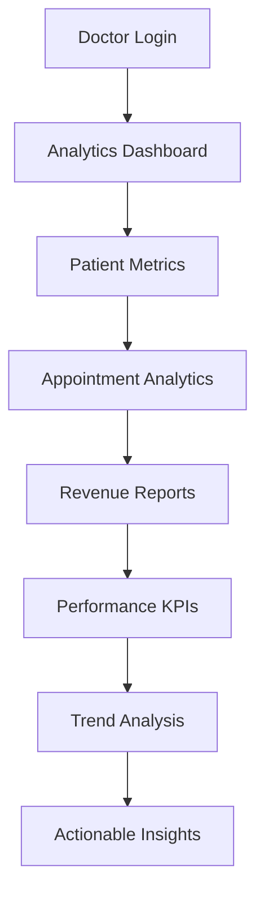

### 2. Population Health Flow

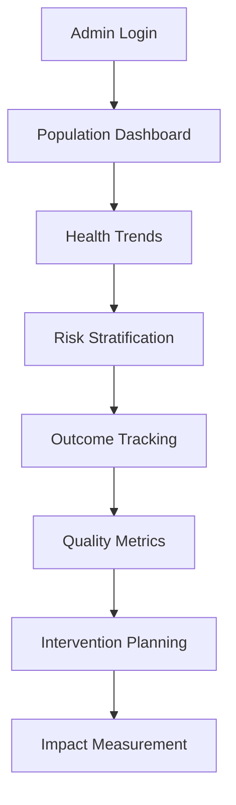

## 🔐 Security and Compliance Flows

### 1. Authentication Flow

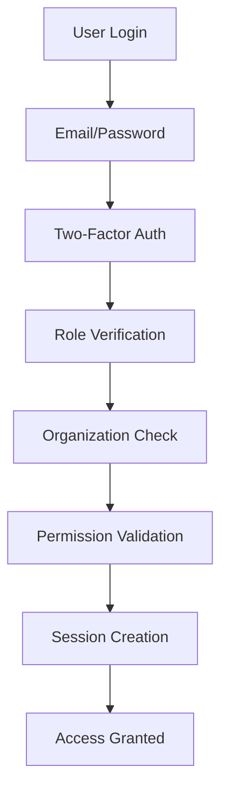

### 2. Data Privacy Flow

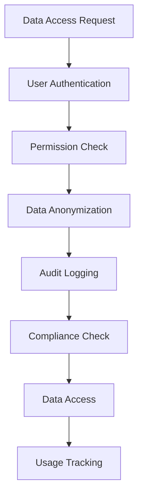

## 🎯 User Journey Mapping

### 1. New Doctor Journey (First 30 Days)

**Week 1: Onboarding**
- Day 1: Registration and profile setup
- Day 2-3: Import existing patient data
- Day 4-5: Configure AI assistant and voice settings
- Day 6-7: First consultations with AI support

**Week 2: Learning**
- Day 8-10: Practice with voice-to-text features
- Day 11-12: Explore reporting and analytics
- Day 13-14: Integrate with existing systems

**Week 3: Optimization**
- Day 15-17: Customize workflows and templates
- Day 18-19: Train staff on new system
- Day 20-21: Optimize appointment scheduling

**Week 4: Mastery**
- Day 22-24: Advanced AI features
- Day 25-26: Patient portal activation
- Day 27-30: Full system utilization

### 2. Patient Journey (First Visit)

**Pre-Visit**
- Registration and profile completion
- Appointment booking
- Pre-visit questionnaire
- Insurance verification

**During Visit**
- Check-in process
- Doctor consultation with AI assistance
- Prescription generation
- Follow-up scheduling

**Post-Visit**
- Prescription delivery
- Test result notifications
- Follow-up reminders
- Portal access for records

## 📈 Success Metrics by Flow

### Doctor Onboarding
- **Time to First Use**: < 30 minutes
- **Profile Completion**: 100% within 24 hours
- **First Consultation**: Within 48 hours
- **Satisfaction Score**: > 4.5/5

### Patient Registration
- **Registration Time**: < 5 minutes
- **Profile Completion**: 90% within first visit
- **Portal Adoption**: 80% within 30 days
- **Satisfaction Score**: > 4.0/5

### Appointment Scheduling
- **Booking Time**: < 2 minutes
- **Confirmation Rate**: 95%
- **No-Show Rate**: < 10%
- **Patient Satisfaction**: > 4.2/5

### AI-Powered Consultation
- **Voice Recognition Accuracy**: > 95%
- **Prescription Generation Time**: < 30 seconds
- **Error Rate**: < 2%
- **Doctor Satisfaction**: > 4.7/5

## 🔄 Continuous Improvement

### Flow Optimization Process
1. **Data Collection**: Track user interactions and pain points
2. **Analysis**: Identify bottlenecks and friction points
3. **Design**: Create improved flow alternatives
4. **Testing**: A/B test new flows with users
5. **Implementation**: Deploy successful improvements
6. **Monitoring**: Track metrics and iterate

### User Feedback Integration
- **In-App Feedback**: Real-time feedback collection
- **User Interviews**: Regular user research sessions
- **Analytics**: Behavioral data analysis
- **Support Tickets**: Issue tracking and resolution
- **Feature Requests**: User-driven development

This comprehensive user flow documentation ensures VirtualDoc provides an intuitive, efficient, and satisfying experience for all user types while maintaining the highest standards of healthcare delivery.
